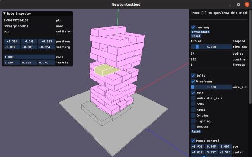

***Work in progress***<br>
***Things claimed in this README may not be implemented yet.***

# newton-rs

[](https://travis-ci.org/germangb/newton-rs)
[](https://germangb.github.io/newton-rs/)

[Newton-Dynamics][repo] safe wrapper for [**Rust**][rustlang].

[repo]: https://github.com/MADEAPPS/newton-dynamics
[rustlang]: https://www.rust-lang.org/

## Building

1. Install build dependencies

* `rust` (recommended method is [rustup](https://rustup.rs))
* `cmake`
* `libclang`
* `libsdl2-dev` optional (testbed feature)

```bash
sudo apt install cmake
sudo apt install libclang-dev
sudo apt install libsdl2-dev # optional
```

2. Declare dependency in your `Cargo.toml`

```toml
[dependencies]
newton = { git = "https://github.com/germangb/newton-rs.git" }
```

## Implemented things

The wrapper gives coverage to a subset of the C API (see [#1][issue]).

* Most Body functions
* Most Collision functions (except mesh)
* Ray casting & convex casting

[issue]: https://github.com/germangb/newton-rs/issues/1

## Unimplemented things

* Documentation
* Constraints (joints)
* Inverse kinematics
* Mesh collisions
* Most callbacks

## Testbed

The newton testbed is a framework to run and inspect physics simulation.

Right now it is available under a feature flag, but eventually it will be moved into its own crate.

```bash
# clone repository with submodules.
git clone --recursive https://github.com/germangb/newton-rs.git

# run one of the examples under the "examples/<name>.rs" directory.
# the "testbed" feature has to be enabled.
cargo run --features testbed --example "<name>"
```


